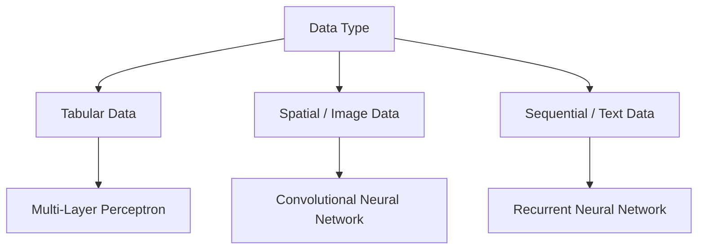

# Lesson 3: Types of Neural Networks & History of Deep Learning

Welcome to my revision notes for **Lesson 3** of the *100 Days of Deep Learning* course by CampusX.

---

## 📚 Topics Covered

1. **Evolution of Deep Learning**: Historical milestones and why deep learning gained massive popularity in the 2010s (increased data volume, GPU computing power).
2. **Artificial Neural Network (ANN) / Multi-layer Perceptron (MLP)**: Fully connected feedforward neural networks designed for tabular data.
3. **Convolutional Neural Networks (CNN)**: Grid-structured architectures designed specifically for image, video, and spatial data.
4. **Recurrent Neural Networks (RNN)**: Sequential neural networks with memory loops, designed for text, time-series, and voice data.
5. **Autoencoders**: Unsupervised neural networks designed for dimensionality reduction, feature extraction, and compression.
6. **Generative Adversarial Networks (GAN)**: Generative models composed of two networks (Generator and Discriminator) competing to create realistic synthetic data.

---

## 📝 Key Revision Points

> [!NOTE]
> Deep learning architectures are chosen based on the underlying structure of the data:
> - **Tabular (tabular columns)** $\rightarrow$ **MLP / ANN**
> - **Grid / Image (pixels)** $\rightarrow$ **CNN**
> - **Sequence / Text (time steps)** $\rightarrow$ **RNN**

- **MLP (Multi-Layer Perceptron)**: Standard feedforward network where every node in a layer is connected to every node in the next layer.
- **CNN (Convolutional Neural Network)**: Utilizes kernel filters to capture spatial features (edges, textures) from images, reducing the parameter count dramatically compared to MLPs.
- **RNN (Recurrent Neural Network)**: Passes information across time-steps via recurrent loops. Great for sequence modeling but susceptible to vanishing gradients.
- **Autoencoders**: Compresses input data into a lower-dimensional bottleneck (encoder) and attempts to reconstruct the original input from it (decoder).
- **GAN (Generative Adversarial Network)**: The Generator creates fake images, and the Discriminator tries to distinguish them from real images. They train together in a minimax game.
