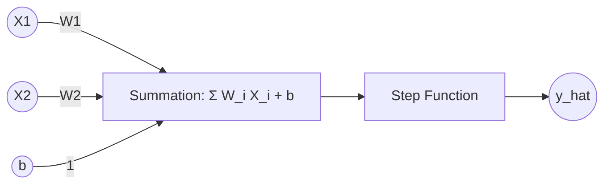

# Lesson 4: Perceptron Foundations & Geometric Intuition

Welcome to my revision notes for **Lesson 4** of the *100 Days of Deep Learning* course by CampusX.

---

## 📚 Topics Covered

1. **What is a Perceptron?**: The fundamental building block of an artificial neural network, invented by Frank Rosenblatt in 1957.
2. **Biological Neuron vs. Artificial Perceptron**: Mapping biological concepts to artificial neural network inputs and parameters.
3. **Geometric Intuition**: Understanding the perceptron as a linear decision boundary (hyperplane).

---

## 📝 Key Revision Points

### Biological vs. Artificial Neuron Mapping
- **Dendrites** $\rightarrow$ **Inputs ($X_1, X_2, \dots, X_d$)**: Receive incoming signals.
- **Synapses** $\rightarrow$ **Weights ($W_1, W_2, \dots, W_d$)**: Scale the importance of inputs.
- **Cell Body** $\rightarrow$ **Summation & Activation**: Calculates the weighted sum and applies step function.
- **Axon** $\rightarrow$ **Output ($y$)**: Passes the output signal.

### Mathematical Formulation
The perceptron calculates a weighted sum of inputs plus a bias and applies a step function:

$$S_i = \sum_{j=1}^{d} w_j X_{ij} + b$$

$$\hat{y}_i = f(S_i) = \begin{cases} 1 & \text{if } S_i \ge 0 \\ 0 & \text{if } S_i < 0 \end{cases}$$

### Geometric Intuition
In a 2D space, the decision boundary of a perceptron is a straight line:
$$w_1 x_1 + w_2 x_2 + b = 0$$

- All points on one side of the line yield a positive value ($\hat{y} = 1$).
- All points on the other side yield a negative value ($\hat{y} = 0$).
- Training a perceptron means finding the weights $w_1, w_2$ and bias $b$ that align this line to perfectly separate two classes.
