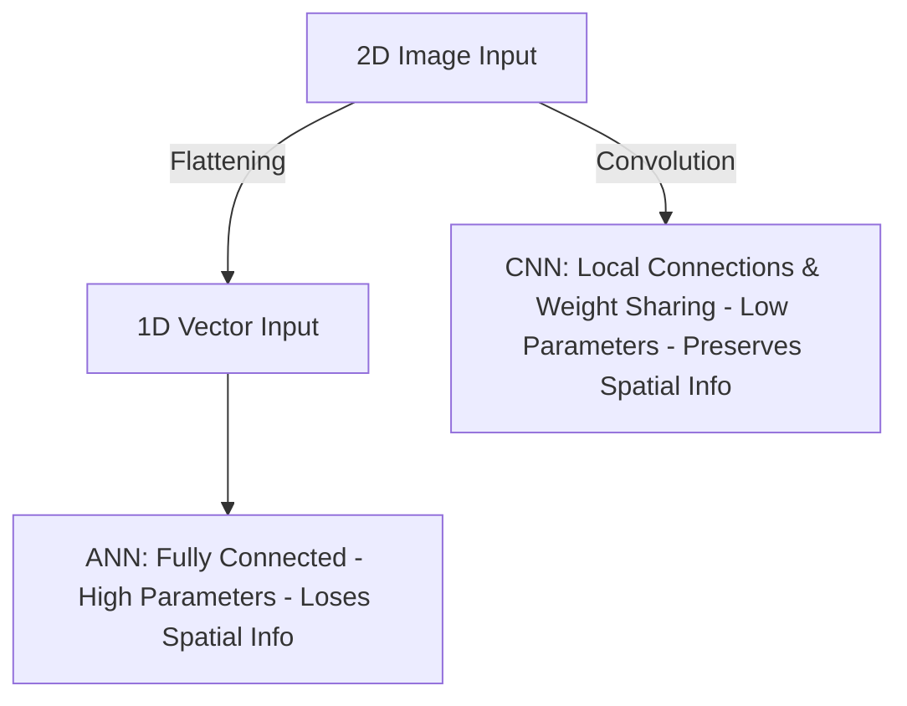

# Lesson 40: Introduction to Convolutional Neural Networks (CNNs)

Welcome to my revision notes for **Lesson 40** of the *100 Days of Deep Learning* course by CampusX.

---

## 📚 Topics Covered

1. **What is a CNN?**: Grids, topologies, and image topologies.
2. **Why ANNs (MLPs) Fail on Image Data**: High computational cost, overfitting, and loss of spatial arrangements.
3. **Core Principles of CNNs**: Local Connectivity and Parameter Sharing.

---

## 📝 Key Revision Points

### The Problem: Why not use Artificial Neural Networks (ANNs) for images?
If we pass a color image of size $100 \times 100 \times 3$ (width, height, RGB channels) to a standard MLP:
1. **High Computational Cost**: The input vector has $100 \times 100 \times 3 = 30,000$ dimensions. If the first hidden layer has $1,000$ neurons, we have:
   $$30,000 \times 1,000 + 1,000 = 30,001,000 \text{ parameters!}$$
   This requires massive memory and doesn't scale to larger images (e.g., $1080\text{p}$).
2. **Overfitting**: Having millions of parameters in the first layer causes the network to memorize the training set, leading to poor generalization.
3. **Loss of Spatial Information**: Flattening a 2D image matrix into a 1D vector completely discards the spatial relationships (which pixel is next to/above/below which).

### How CNNs Solve the Problem
CNNs introduce two core constraints that match the properties of images:

1. **Local Connectivity (Local Receptive Fields)**: Neurons in a convolutional layer do not connect to every pixel in the input image. Instead, they only connect to a small local patch (e.g., $3 \times 3$ pixels).
2. **Parameter Sharing**: Instead of having separate weights for every region of the image, the same filter weights (kernel) are convolved (slid) across the entire image. If a filter learns to detect horizontal edges, it can detect them anywhere in the image.

