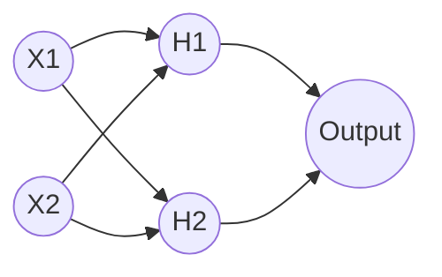

# Lesson 7: Problem with Perceptron (The XOR Problem)

Welcome to my revision notes for **Lesson 7** of the *100 Days of Deep Learning* course by CampusX.

---

## 📚 Topics Covered

1. **Linear Separability**: The fundamental limit of a single perceptron.
2. **The XOR Problem**: Proving that a single perceptron cannot solve non-linear classification problems.
3. **Multi-layer Perceptron (MLP) Introduction**: How adding hidden layers solves non-linear problems.
4. **TensorFlow Playground Walkthrough**: Interactive proof of boundary transformations.

---

## 📝 Key Revision Points

### Single Perceptron Limitation
A single perceptron creates a linear decision boundary (a straight line in 2D, plane in 3D). It can solve:
- **AND gate** (Linearly separable)
- **OR gate** (Linearly separable)

However, it fails on:
- **XOR gate** (Non-linearly separable)

| $X_1$ | $X_2$ | XOR Output |
|---|---|---|
| 0 | 0 | 0 (Class A) |
| 0 | 1 | 1 (Class B) |
| 1 | 0 | 1 (Class B) |
| 1 | 1 | 0 (Class A) |

If you plot these points on a 2D plane, you cannot draw a single straight line that separates Class A (0s) from Class B (1s).

### Multi-layer Perceptron (MLP) Solution
To solve non-linear classification problems, we must stack multiple perceptrons in layers:
1. **Input Layer**: Feeds features into the network.
2. **Hidden Layer(s)**: Transforms features into a new space using activation functions.
3. **Output Layer**: Performs the final classification.

By adding a hidden layer with non-linear activation functions (like Sigmoid), the input space is bent and warped, allowing a final linear classifier in the output layer to separate the classes.
